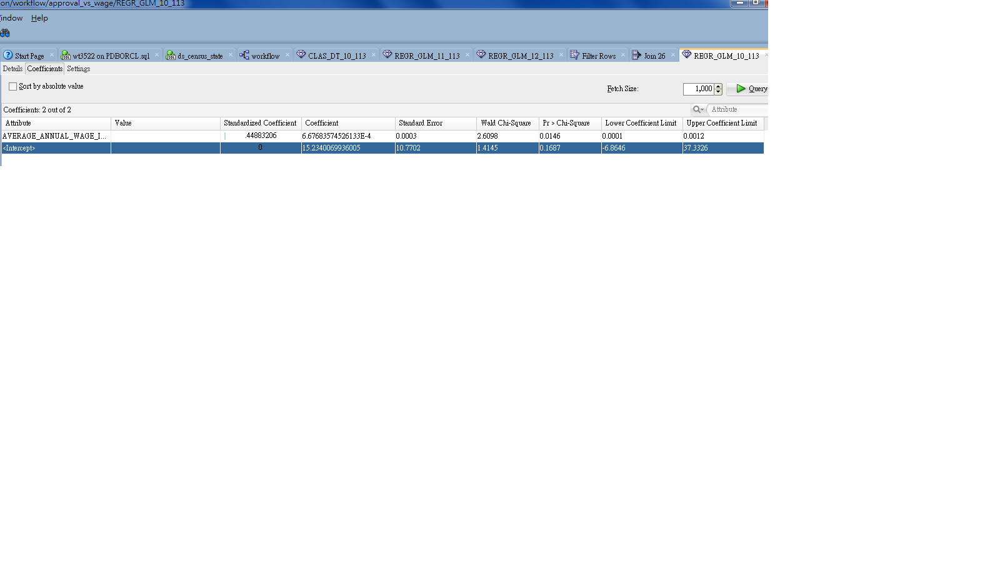

Data Science Fall 2014 Project
===
**This is the analyzing the population of the United States during 2009 to 2010 and the president voting result in 2012. The analyse is mostly focusing on finding the correlation between population and voting result, and in addition why the population is distributed in the way it is. All the data used can be found in http://www.census.gov**

##Factors Affecting the Voting Result
**The first thing we investigated is to find out what factors play the most significant role in affecting people's choice of the president election in 2012. We assumed that economic factors would be the important ones, thus we used decision tree model from oracle data miner to help determining the factors that would actually make an impact. We used employment rate and the average annual wage of each state as inputs of the model to predict the choice of candidate in each state. The resulting model is shown below:**

******
 
******

**This model shows that the states with average annual wage more than 40k are more likely to vote for Barack Obama. This is different from the general belief that richer people tend to vote for Republican.**

**A possible cause for this result is that people with higher salary are content with Obama's performance in the previous 4 years since they are earning decently at that time. To show that this assumption is indeed the cause, we ran an aggression model of oracle data miner to see if there is a positive correlation between Obama's approval rate at 2012 of each state and the salary of each state. This picture below shows how we builded the model:**

******
 
******

**And the resulting model below shows that this positive correlation indeed exists since the coefficient value is positive.**

******
 
******

##Population Distribution
**The next thing we tried to investigate is what determines people to live in the state they live right now. A portion of the source data we have is shown as below:**
******
 
******

**Foreign_Total is the total foreigner population of each state.**
**Born_Outside_US_Total is the non-foreign population who are born out side of the US.**
**Different_State means the non-foreign residents of a state who originate from another state.**
**State_of_Resident is the non-foreign state residents who are born in that state.**
**Total_Native is the sum of Different_State, State_of_Resident and Born_Outside_US_Total**

**All the analysis done afterward were based on precent, which is the above values divided by the total population of each state. We tried to investigate the behavior of each kind of people.** 

**Initially we thought that employment ratio and wage would be the major reasons for all kind of people to consider to move to a state or not. But after using the regression models, it appears that only the percent for Born_Outside_US_Total is affected by employment ratio and wage, as shown below:**

******
 
******

**Next we added the data that indicates that education level of each state to the regression models. This data shows the percentage of people who have high school degree, bachelor and advanced degree respectively in each state. The new models show a positive correlation between Foreign_Total and the percent of people with bachelor degree, as shown below:**

******
 
******

**An interesting result from this model is that there is actually a negative correlation between Foreign_Total and those variables related to jobs, such as employment ratio, wage, and advanced degree since people with master degree or higher are either employed or seeking for employment. The trend indicates that most foreigners come to the U.S to seek for education for Master or Doctor degree.**

**At last, we tried to filter out the states which have more than 50% of its residents from other states to see what they share in common, there are 4 states with such condition, which are AK, NV, NH and WY. As shown in the table below in the column Different_State_Ratio:**

******
 
******

**One similarity that they share is they have quite a small number of total population compared to other states. This finding made us believe that the fact that we analysed our data based on percentage might be the main cause for making those states look like they have more people from other states. However, later we found out that there is another key factor, which is the four states aboved have no income tax. There are states with no income tax but low different state ratio, namely TX and FL, but they all have a high number of total population. Thus we conclude that income tax is most important factor that Americans use to decide whether to live in a state or not.**

